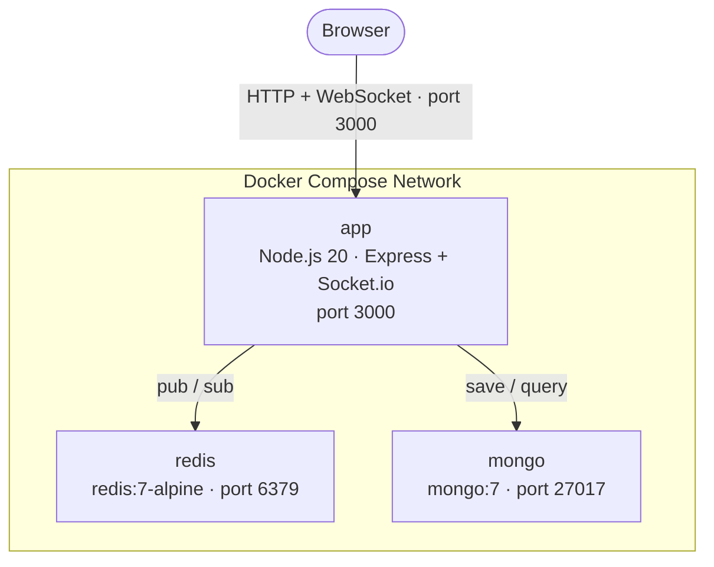
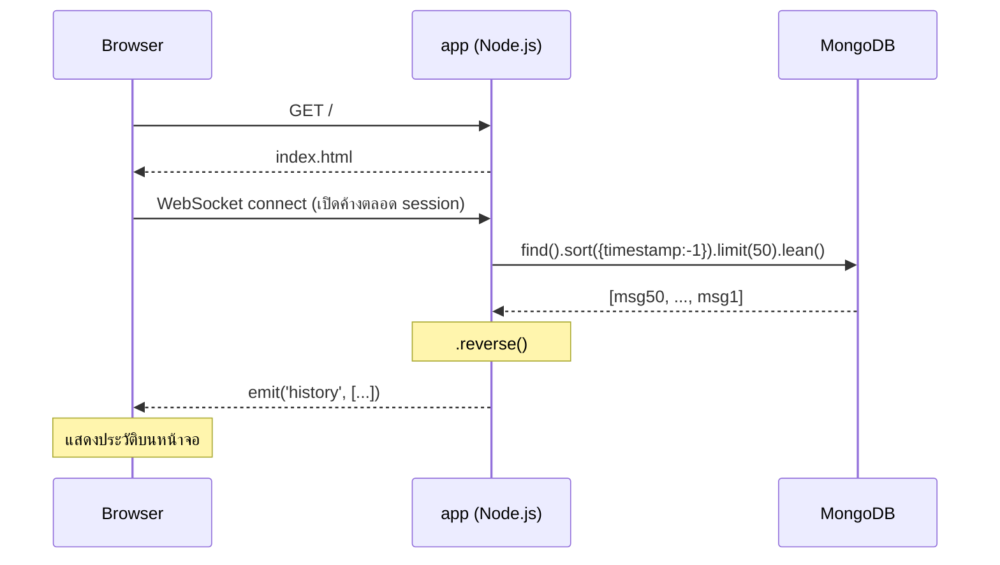
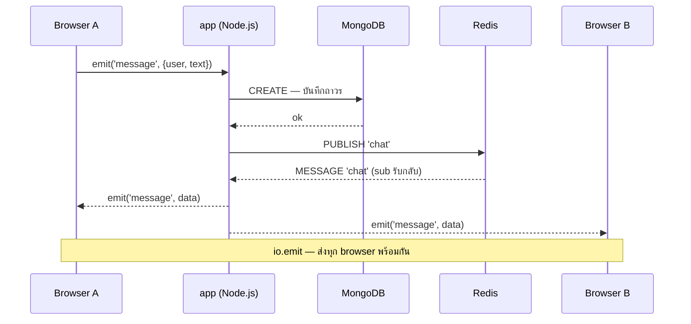
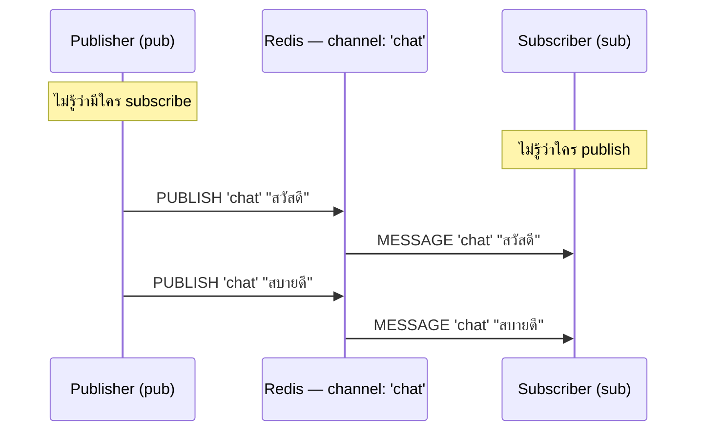
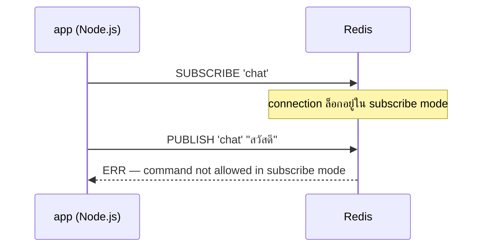
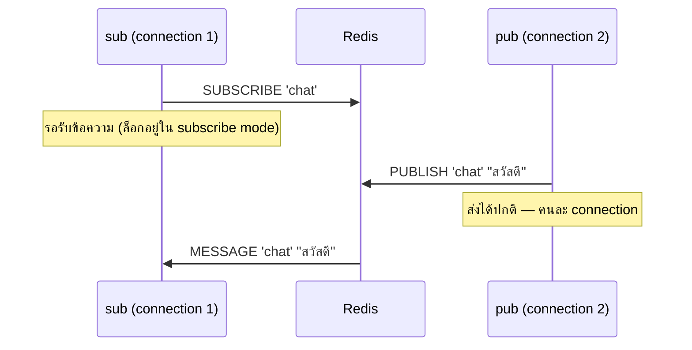

# ChatBox — อธิบายการทำงานและ Configuration หลัก

## 1. ภาพรวมระบบ

ChatBox คือแอปพลิเคชันแชทแบบเรียลไทม์ที่ทำงานบน Docker Compose ประกอบด้วย 3 container ที่ทำงานร่วมกัน ได้แก่ Node.js สำหรับ web server, Redis สำหรับกระจายข้อความระหว่าง server, และ MongoDB สำหรับเก็บประวัติการสนทนา



---

## 2. Use Case การทำงาน

### UC1 — ผู้ใช้เข้าห้องแชทและรับประวัติการสนทนา

**ผู้กระทำ:** ผู้ใช้งาน (Browser)

**ขั้นตอน:**

1. ผู้ใช้เปิดเบราว์เซอร์ไปที่ `http://localhost:3000`
2. กรอกชื่อผู้ใช้และกด "เข้าห้อง Chat"
3. เบราว์เซอร์เชื่อมต่อกับ server ผ่าน WebSocket โดยอัตโนมัติ
4. Server ดึงข้อความ 50 รายการล่าสุดจาก MongoDB และส่งกลับให้ทันที
5. ผู้ใช้เห็นประวัติการสนทนาก่อนหน้าบนหน้าจอ

**ผลลัพธ์:** ผู้ใช้เข้าสู่ห้องแชทพร้อมเห็นประวัติการสนทนาย้อนหลัง

---

### UC2 — ผู้ใช้ส่งข้อความแบบเรียลไทม์

**ผู้กระทำ:** ผู้ใช้งาน (Browser)

**ขั้นตอน:**

1. ผู้ใช้พิมพ์ข้อความและกด "ส่ง"
2. เบราว์เซอร์ส่งข้อความไปยัง server ผ่าน WebSocket (`socket.emit`)
3. Server บันทึกข้อความลง MongoDB พร้อม username และ timestamp
4. Server ส่งข้อความไปยัง Redis channel ชื่อ `chat` (publish)
5. Redis กระจายข้อความไปยัง server instance ทุกตัวที่ subscribe อยู่
6. Server รับข้อความจาก Redis แล้วกระจายให้เบราว์เซอร์ทุกตัวที่เชื่อมต่ออยู่ (`io.emit`)
7. ผู้ใช้ทุกคนในห้องเห็นข้อความทันที

**ผลลัพธ์:** ข้อความปรากฏพร้อมกันในทุกเบราว์เซอร์แบบเรียลไทม์

---

### UC3 — รองรับผู้ใช้หลายคนพร้อมกัน

**ผู้กระทำ:** ผู้ใช้หลายคน (Browser หลายหน้าต่าง)

**ขั้นตอน:**

1. ผู้ใช้คนที่ 2 เปิดเบราว์เซอร์แยก และเข้าห้องแชทด้วยชื่อต่างกัน
2. ผู้ใช้คนที่ 1 ส่งข้อความ
3. ผ่านกลไก Redis pub/sub ข้อความกระจายถึงทุก connection พร้อมกัน
4. ผู้ใช้คนที่ 2 เห็นข้อความทันทีโดยไม่ต้อง refresh

**ผลลัพธ์:** ทุก session แยกกันแต่รับข้อความเดียวกันพร้อมกัน

---

### UC4 — ข้อมูลคงอยู่แม้ระบบ restart

**ผู้กระทำ:** ผู้ดูแลระบบ

**ขั้นตอน:**

1. รัน `docker compose down` เพื่อหยุดทุก container
2. รัน `docker compose up -d` เพื่อเริ่มใหม่
3. ผู้ใช้เปิดเบราว์เซอร์และเข้าห้องแชท
4. Server ดึงข้อมูลจาก MongoDB volume ที่ยังคงอยู่
5. ผู้ใช้เห็นประวัติการสนทนาก่อนหน้าครบถ้วน

**ผลลัพธ์:** ข้อมูลการสนทนาไม่สูญหายแม้จะหยุดและเริ่มระบบใหม่

---

## 3. End-to-End Flow — การไหลของข้อมูลตั้งแต่ต้นจนจบ

### 3.1 Flow การเข้าห้องแชทและรับ History



**จุดสำคัญ:** WebSocket เปิด connection ค้างไว้ตลอด — ต่างจาก HTTP ที่เปิด/ปิดทุก request ทำให้ server ส่งข้อมูลหา browser ได้ทันทีโดยไม่ต้องรอให้ browser ถาม

---

### 3.2 Flow การส่งข้อความ (กรณีมี 2 ผู้ใช้)



**ทำไมต้องวนผ่าน Redis แทนที่จะ `io.emit` ตรงๆ:**
ถ้า app มีแค่ instance เดียว การ `io.emit` ตรงก็พอ แต่เมื่อ scale เป็นหลาย instance แต่ละตัวมี connection ของตัวเอง — Browser A อาจเชื่อมกับ instance 1 ส่วน Browser B เชื่อมกับ instance 2 ถ้า instance 1 `io.emit` ตรง Browser B จะไม่ได้รับข้อความเลย Redis จึงทำหน้าที่เป็น "กระดานกลาง" ที่ทุก instance รับฟังพร้อมกัน

---

## 4. Redis คืออะไร

Redis ย่อมาจาก **Remote Dictionary Server** — เป็น database ที่เก็บข้อมูลไว้ใน **RAM** แทนที่จะเขียนลง disk เหมือน MongoDB หรือ MySQL เพราะอยู่ใน RAM ทำให้ read/write เร็วมาก อยู่ในระดับ microsecond เทียบกับ disk-based database ที่ millisecond

### 4.1 โครงสร้างข้อมูลที่ Redis รองรับ

Redis ไม่ได้เก็บแค่ key-value ธรรมดา — รองรับหลาย type ซึ่งแต่ละอันเหมาะกับงานต่างกัน

| Type    | ตัวอย่างการใช้งาน          |
| ------- | -------------------------- |
| String  | cache ผลลัพธ์จาก API       |
| List    | queue งาน                  |
| Hash    | เก็บ session ของ user      |
| Set     | ติดตาม user ที่ online     |
| Pub/Sub | กระจายข้อความแบบ broadcast |

### 4.2 Redis ใช้ทำอะไรในงานจริง

- **Cache** — เก็บผลลัพธ์ที่คำนวณแพงไว้ชั่วคราว แทนที่จะ query database ซ้ำทุกครั้ง
- **Session store** — เก็บ login session ของ user
- **Rate limiting** — นับว่า IP นี้เรียก API กี่ครั้งใน 1 นาที
- **Pub/Sub** — กระจายข้อความระหว่าง service (ที่ใช้ใน ChatBox)
- **Queue** — ส่งงานให้ background worker ทำ

### 4.3 ข้อจำกัดของ Redis

ข้อมูลอยู่ใน RAM — ถ้าเครื่องดับกระแสไฟ ข้อมูลหาย (เว้นแต่เปิด persistence) ดังนั้น Redis จึงไม่เหมาะเป็น primary database แต่เหมาะเป็น **ตัวช่วย** ที่ทำงานคู่กับ database หลัก

ตรงกับบทบาทใน ChatBox — Redis ทำแค่ pub/sub เพื่อกระจายข้อความแบบ real-time ส่วน MongoDB เป็นตัวเก็บข้อมูลถาวร

---

## 5. Redis Pub/Sub — กลไกกระจายข้อความ

### 5.1 แนวคิดพื้นฐาน

Redis Pub/Sub เป็นรูปแบบการสื่อสารแบบ "ออกอากาศ" (broadcast) — ผู้ส่ง (publisher) ส่งข้อความไปยัง channel โดยไม่รู้ว่ามีใครรับอยู่ และผู้รับ (subscriber) รับข้อความจาก channel โดยไม่รู้ว่าใครส่งมา ทั้งสองฝ่ายทำงานแยกจากกันอย่างสมบูรณ์



### 5.2 Channel คืออะไร

Channel คือชื่อที่ใช้จัดกลุ่มข้อความ — เหมือนความถี่วิทยุ ผู้ที่จะรับข้อความได้ต้องตั้งช่องให้ตรงกัน ใน ChatBox ใช้ channel ชื่อ `chat` channel เดียว ทำให้ทุก server instance รับข้อความจากผู้ใช้ทุกคนได้

```javascript
sub.subscribe("chat"); // ตั้งช่องรับ
pub.publish("chat", data); // ส่งออกอากาศ
```

### 5.3 ทำไมต้องแยก pub และ sub เป็น 2 connection

**กรณีที่ 1 — ผิด: ใช้ connection เดียวกัน**



**กรณีที่ 2 — ถูก: แยก 2 connection**



เมื่อ connection เข้าสู่โหมด `subscribe` แล้ว Redis จะล็อก connection นั้นให้รับได้เพียงคำสั่ง `SUBSCRIBE`, `UNSUBSCRIBE`, `PSUBSCRIBE`, `PUNSUBSCRIBE` เท่านั้น การ `PUBLISH` บน connection เดิมจะได้รับ error ทันที

### 5.4 ลำดับการเริ่มต้นของ sub ใน server.js

```javascript
// ทำงานทันทีที่ server เริ่ม — ไม่รอให้มี connection จาก browser
sub.subscribe("chat");

sub.on("message", (channel, data) => {
  io.emit("message", JSON.parse(data));
});
```

`sub` เปิดรับฟัง channel `chat` ตั้งแต่ server เริ่มทำงาน ทำให้ไม่พลาดข้อความใดเลย และเมื่อมีข้อความเข้ามาจะกระจายให้ browser ทุกตัวที่เชื่อมต่ออยู่ผ่าน `io.emit` ทันที

---

## 6. อธิบาย Configuration หลัก

### 6.1 `docker-compose.yml` — ไฟล์ควบคุมระบบทั้งหมด

```yaml
services:
  app:
    build: .
    ports:
      - "3000:3000"
    environment:
      - MONGO_URL=mongodb://mongo:27017/chatbox
      - REDIS_URL=redis://redis:6379
    depends_on:
      - mongo
      - redis

  mongo:
    image: mongo:7
    volumes:
      - mongo_data:/data/db

  redis:
    image: redis:7-alpine

volumes:
  mongo_data:
```

| ส่วน                           | ความหมาย                                                                                                                                                      |
| ------------------------------ | ------------------------------------------------------------------------------------------------------------------------------------------------------------- |
| `build: .`                     | สั่งให้ Docker build image จาก Dockerfile ในโฟลเดอร์ปัจจุบัน แทนการใช้ image สำเร็จรูป                                                                        |
| `ports: "3000:3000"`           | เปิดพอร์ต 3000 บน host ให้เชื่อมกับพอร์ต 3000 ใน container เพื่อให้เบราว์เซอร์เข้าถึงได้                                                                      |
| `environment`                  | ส่งตัวแปรสภาพแวดล้อมเข้า container โดยใช้ **ชื่อ service** (`mongo`, `redis`) เป็น hostname แทน IP address เพราะ Compose สร้าง DNS ภายใน network ให้อัตโนมัติ |
| `depends_on`                   | กำหนดลำดับการเริ่ม — app จะ start หลัง mongo และ redis เท่านั้น                                                                                               |
| `volumes: mongo_data:/data/db` | ผูก named volume กับโฟลเดอร์ที่ MongoDB เก็บข้อมูล ทำให้ข้อมูลคงอยู่แม้ container ถูกลบ                                                                       |

---

### 6.2 `Dockerfile` — วิธี build image ของ app

```dockerfile
FROM node:20-alpine
WORKDIR /app
COPY package*.json ./
RUN npm install
COPY . .
EXPOSE 3000
CMD ["node", "server.js"]
```

| คำสั่ง                                  | ความหมาย                                                                                                                             |
| --------------------------------------- | ------------------------------------------------------------------------------------------------------------------------------------ |
| `FROM node:20-alpine`                   | ใช้ Node.js 20 บน Alpine Linux (image ขนาดเล็ก ~5MB แทน ~900MB ของ Ubuntu)                                                           |
| `COPY package*.json ./` ก่อน `COPY . .` | Docker build เป็นชั้น (layer) — ถ้า `package.json` ไม่เปลี่ยน Docker จะใช้ cache ของ `npm install` ทำให้ build ครั้งถัดไปเร็วขึ้นมาก |
| `RUN npm install`                       | ติดตั้ง dependencies ภายใน image ไม่ใช่บน host                                                                                       |
| `CMD ["node", "server.js"]`             | คำสั่งที่รันเมื่อ container เริ่มทำงาน                                                                                               |

---

### 6.3 `server.js` — Logic หลักของ application

#### การเชื่อมต่อ Redis แบบแยก 2 instance

```javascript
const pub = new Redis(process.env.REDIS_URL);
const sub = new Redis(process.env.REDIS_URL);
```

Redis มีข้อจำกัดว่า connection ที่อยู่ในโหมด `subscribe` จะรับได้เพียงคำสั่งที่เกี่ยวกับ pub/sub เท่านั้น ไม่สามารถใช้ `publish` บน connection เดิมได้ จึงต้องแยกเป็น 2 instance เพื่อให้ทั้งส่งและรับข้อความได้พร้อมกัน

#### MongoDB Schema

```javascript
const messageSchema = new mongoose.Schema({
  username: String,
  text: String,
  timestamp: { type: Date, default: Date.now },
});
```

กำหนดโครงสร้างข้อมูลของแต่ละข้อความ โดย `timestamp` มีค่าเริ่มต้นเป็นเวลาปัจจุบันอัตโนมัติ ทำให้ไม่ต้องส่งค่านี้มาจาก client

#### การดึง History

```javascript
const history = await Message.find().sort({ timestamp: -1 }).limit(50).lean();
socket.emit("history", history.reverse());
```

ดึงข้อมูลโดยเรียงจากใหม่ไปเก่า (desc) แล้ว limit 50 เพื่อประสิทธิภาพ จากนั้น `reverse()` กลับลำดับก่อนส่ง เพื่อให้หน้าจอแสดงจากเก่าไปใหม่ (บนลงล่าง) ตามรูปแบบการแชทปกติ

#### กระบวนการส่งข้อความ

```javascript
socket.on("message", async (data) => {
  await Message.create(data); // 1. บันทึกลง MongoDB
  pub.publish("chat", JSON.stringify(data)); // 2. กระจายผ่าน Redis
});

sub.on("message", (channel, data) => {
  io.emit("message", JSON.parse(data)); // 3. ส่งให้ทุก browser
});
```

ลำดับการทำงาน: รับจาก client → บันทึกถาวร → กระจายผ่าน Redis → ส่งให้ทุกคน การใช้ Redis เป็นตัวกลางทำให้ต่อไปสามารถ scale เป็นหลาย server instance ได้ โดยทุก instance จะรับข้อความจาก Redis และกระจายให้ client ของตัวเองได้อย่างถูกต้อง

---

## 7. สรุปบทบาทของแต่ละ Service

| Service | Image                             | บทบาท                                                         | เหตุที่เลือก                                                                                |
| ------- | --------------------------------- | ------------------------------------------------------------- | ------------------------------------------------------------------------------------------- |
| app     | Node.js 20 (build จาก Dockerfile) | รับ WebSocket จาก browser, ประสานงานระหว่าง Redis และ MongoDB | Node.js เหมาะกับ I/O-heavy และ real-time เพราะเป็น event-driven non-blocking                |
| redis   | redis:7-alpine                    | กระจายข้อความระหว่าง server instance ผ่าน pub/sub             | Redis pub/sub มี latency ต่ำมาก เหมาะกับการกระจายข้อความแบบเรียลไทม์                        |
| mongo   | mongo:7                           | เก็บประวัติการสนทนาแบบถาวร                                    | MongoDB เก็บข้อมูลในรูปแบบ JSON-like ตรงกับโครงสร้างข้อความแชท ไม่ต้องออกแบบ schema ซับซ้อน |
